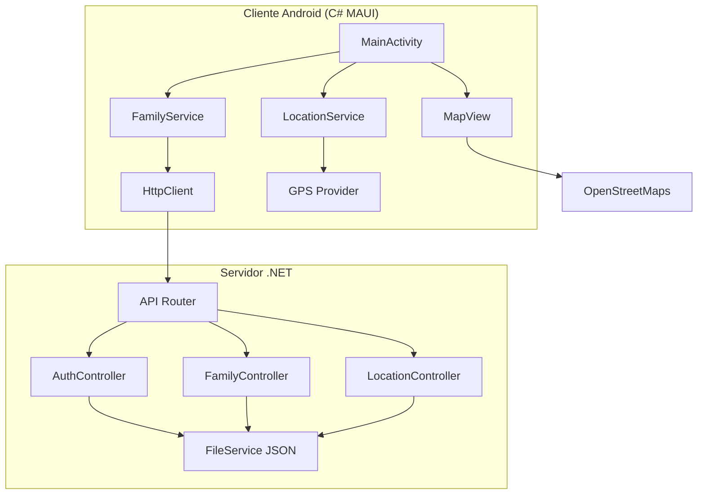

# Documento de Diseño - FamilyTogether

## Visión General

FamilyTogether es un sistema de monitorización familiar compuesto por dos componentes principales:
1. **Servidor .NET**: API REST que gestiona autenticación, grupos familiares y datos de ubicación
2. **Aplicación Android C# MAUI**: Cliente móvil con interfaz simple y comunicación en tiempo real

La arquitectura prioriza simplicidad, eficiencia de batería, actualizaciones en tiempo real y almacenamiento en archivos JSON.

## Arquitectura

### Arquitectura del Sistema



### Componentes Principales

#### Servidor .NET
- **API REST**: Endpoints para autenticación, gestión familiar y ubicaciones usando ASP.NET Core
- **Almacenamiento JSON**: Archivos JSON para usuarios, familias y ubicaciones
- **Autenticación JWT**: Tokens seguros con expiración de 24 horas usando Microsoft.AspNetCore.Authentication.JwtBearer

#### Aplicación Android MAUI
- **Arquitectura Simple**: Sin ViewModels, lógica directa en Code-Behind
- **Servicios Singleton**: Para gestión de ubicación y comunicación con API
- **Interfaz Material Design**: Usando controles nativos de MAUI
- **Mapa OpenStreetMaps**: Integración con Mapsui para MAUI
- **Servicios Background**: Foreground Service para ubicación continua
- **Gestión de Permisos**: Solicitud automática de permisos críticos del sistema
- **Polling**: Consultas periódicas al servidor para actualizaciones

## Componentes e Interfaces

### Servidor .NET - Estructura de Proyecto

```
/FamilyTogether.Server
├── /Controllers
│   ├── AuthController.cs
│   ├── FamilyController.cs
│   └── LocationController.cs
├── /Models
│   ├── User.cs
│   ├── Family.cs
│   └── LocationUpdate.cs
├── /Services
│   ├── FileService.cs
│   ├── AuthService.cs
│   └── LocationService.cs

├── /Data
│   ├── users.json
│   ├── families.json
│   └── locations.json
├── Program.cs
└── appsettings.json
```

### Aplicación MAUI - Estructura de Proyecto

```
/FamilyTogether.App
├── /Pages
│   ├── LoginPage.xaml
│   ├── MainPage.xaml
│   ├── FamilyManagementPage.xaml
│   ├── JoinFamilyPage.xaml
│   └── PermissionsPage.xaml
├── /Services
│   ├── ApiService.cs
│   ├── LocationService.cs

│   ├── BackgroundService.cs
│   └── PermissionService.cs
├── /Models
│   ├── User.cs
│   ├── Family.cs
│   └── LocationUpdate.cs
├── /Controls
│   └── FamilyMemberCard.cs
└── /Platforms/Android
    ├── LocationForegroundService.cs
    ├── BootReceiver.cs
    └── AndroidManifest.xml
```

### APIs Principales

#### Endpoints REST

```
POST /api/auth/login
POST /api/auth/register
POST /api/family/create
POST /api/family/join
GET  /api/family/members
POST /api/family/approve-member
DELETE /api/family/remove-member
POST /api/location/update
GET  /api/location/family-locations
```


## Modelos de Datos

### Almacenamiento en Archivos JSON

#### users.json
```json
{
  "users": [
    {
      "id": 1,
      "email": "user@example.com",
      "passwordHash": "hashed_password",
      "name": "Usuario Ejemplo",
      "createdAt": "2024-01-01T00:00:00Z"
    }
  ]
}
```

#### families.json
```json
{
  "families": [
    {
      "id": 1,
      "familyGuid": "550e8400-e29b-41d4-a716-446655440000",
      "name": "Familia García",
      "createdBy": 1,
      "createdAt": "2024-01-01T00:00:00Z",
      "members": [
        {
          "userId": 1,
          "isAdmin": true,
          "status": "active",
          "joinedAt": "2024-01-01T00:00:00Z"
        }
      ]
    }
  ]
}
```

#### locations.json
```json
{
  "locations": [
    {
      "id": 1,
      "userId": 1,
      "latitude": 40.7128,
      "longitude": -74.0060,
      "accuracy": 5.0,
      "timestamp": "2024-01-01T12:00:00Z"
    }
  ]
}
```

### Modelos C# MAUI

#### User.cs
```csharp
public class User
{
    public int Id { get; set; }
    public string Email { get; set; }
    public string Name { get; set; }
    public DateTime LastSeen { get; set; }
    public bool IsOnline { get; set; }
}
```

#### LocationUpdate.cs
```csharp
public class LocationUpdate
{
    public int UserId { get; set; }
    public double Latitude { get; set; }
    public double Longitude { get; set; }
    public float Accuracy { get; set; }
    public DateTime Timestamp { get; set; }
}
```

## Gestión de Errores

### Servidor .NET
- **Códigos HTTP estándar**: 200, 400, 401, 403, 404, 500
- **Respuestas JSON consistentes**: `{"success": bool, "message": string, "data": object}`
- **Logging**: ILogger con Serilog para archivos con rotación diaria
- **Validación**: Data Annotations y FluentValidation para inputs
- **Manejo de archivos**: Bloqueo de archivos para escritura concurrente segura

### Aplicación MAUI
- **Try-Catch global**: Captura de excepciones no manejadas
- **Mensajes amigables**: Traducción de errores técnicos a lenguaje usuario
- **Retry automático**: Para fallos de red temporales (máximo 3 intentos)
- **Modo offline**: Almacenamiento local temporal cuando no hay conexión

## Permisos y Servicios Background

### Permisos Android Requeridos
```xml
<!-- Ubicación -->
<uses-permission android:name="android.permission.ACCESS_FINE_LOCATION" />
<uses-permission android:name="android.permission.ACCESS_COARSE_LOCATION" />
<uses-permission android:name="android.permission.ACCESS_BACKGROUND_LOCATION" />

<!-- Servicios Background -->
<uses-permission android:name="android.permission.FOREGROUND_SERVICE" />
<uses-permission android:name="android.permission.FOREGROUND_SERVICE_LOCATION" />
<uses-permission android:name="android.permission.WAKE_LOCK" />

<!-- Inicio automático -->
<uses-permission android:name="android.permission.RECEIVE_BOOT_COMPLETED" />
<uses-permission android:name="android.permission.REQUEST_IGNORE_BATTERY_OPTIMIZATIONS" />

<!-- Red -->
<uses-permission android:name="android.permission.INTERNET" />
<uses-permission android:name="android.permission.ACCESS_NETWORK_STATE" />
```

### Servicios Background
- **LocationForegroundService**: Servicio en primer plano para ubicación continua
- **BootReceiver**: Receptor para inicio automático tras reinicio del dispositivo
- **PermissionService**: Gestión centralizada de solicitudes de permisos
- **BackgroundService**: Coordinación de tareas en segundo plano

### Gestión de Batería
- **Solicitud de exclusión**: Petición automática para excluir de optimización de batería
- **Notificación persistente**: Indicador visual del servicio activo
- **Modo adaptativo**: Reducción de frecuencia según estado del dispositivo

